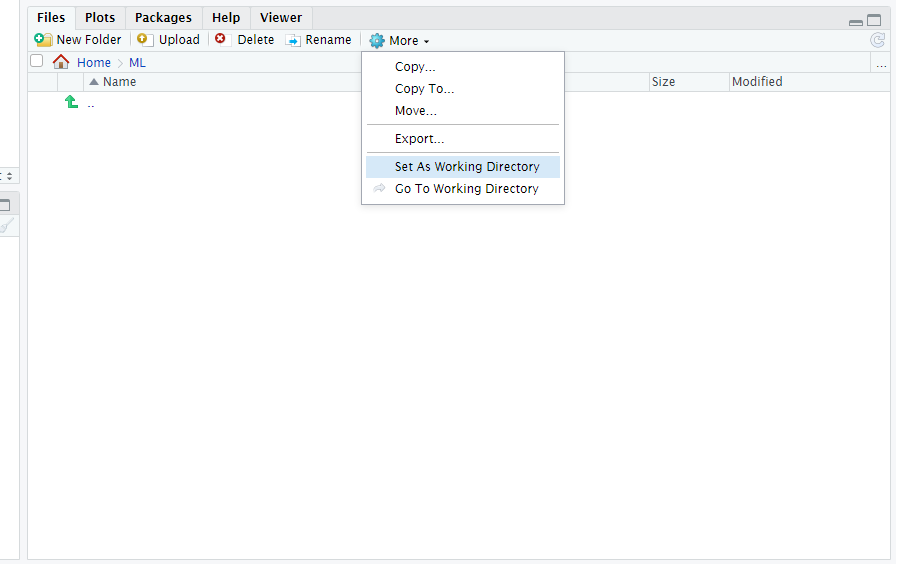

<font face="Microsoft JhengHei">
```{r echo=FALSE, out.width='100%'}

```
<p align="right"><font size=3% face="Microsoft JhengHei">本版本正在測試階段，如有任何問題請回報</font> </p>
<p align="right"><font size=3% face="Microsoft JhengHei">資料倉儲科 李嘉桓 #2134</font></p>

***

# **使用說明** 
* 此平台建議有初階R語言能力者使用，初學者建議使用國泰學習網[R與Python教育訓練](https://cathay.elearn.com.tw/dist/index.html#/learning-passport/incomplete-courses/course-info/9608351)完成初階課程。
* 請將語法複製至本機Rstudio或server版上使用執行(不同環境kernel可能會有所不同)，將要執行的程式碼選取，按鍵盤Ctrl+Enter執行語法。
* 若出現紅色指示圖案，為必要執行語法，不用修改直接執行即可。
```{r echo=FALSE, out.width='2%'}

```
* 若出現綠色指示圖案，為必要執行語法，但須根據需求修改部分內容執行。
```{r echo=FALSE, out.width='2%'}

```
* 每一台電腦的R版本不一樣，預設套件也不同，若跳出缺少套件的訊息，請自行安裝相關套件。
* 建議將文件建立在R根目錄下開一個新資料夾當工作環境。
* 以下以Kaggle中[Default of Credit Card Clients Dataset](https://www.kaggle.com/uciml/default-of-credit-card-clients-dataset/home)資料作為範例。

***

# **環境設定**

* 清理工作環境，避免環境存留資訊佔用記憶體空間。
* 載入所需package套件，若無則自動安裝。
* 設定工作路徑，沒特別設定則以當前環境當作，也可以在Rstudio右下方的Files頁自行設定路徑。

```{r echo=FALSE, out.width='50%'}

```

```{r echo=FALSE, out.width='8%'}
knitr::include_graphics('./sys/red.jpeg')
```

```{r message=FALSE, warning=FALSE, paged.print=FALSE}
rm(list = ls())

if (!require("ggplot2")) install.packages("ggplot2")
library('ggplot2')
if (!require("caret")) install.packages("caret")
library('caret')
if (!require("doParallel")) install.packages("doParallel")
library('doParallel')
if (!require("MLmetrics")) install.packages("MLmetrics")
library('MLmetrics')

set.seed(100)
path = getwd()
# path = '~/ML' # 自定義路徑
dir.create(file.path(path, "model"), showWarnings = FALSE) # model儲存位置
gc()
```


# **資料處理**
## 檔名設定

* **TrainDataFile**為訓練資料檔名，**TestDataFile**為測試資料檔名，建議使用csv檔放置環境路徑。
* **KeyColumn**為資料識別欄位名稱，通常為key且不會重複的值，如ID、保單號碼。
* **TargetColumn**為應變數Y的欄位名稱。
* **OutputAnswer**為要產出結果的檔名。
* **MissingTypes**為讀取空字串先用NA表示。

```{r echo=FALSE, out.width='8%'}

```

```{r}
TrainDataFile = 'train.csv'
TestDataFile  = 'test.csv'
KeyColumn  = 'ID'
TargetColumn  = 'default.payment.next.month'
OutputAnswer  = 'outputdata'
MissingTypes = c("", "NA") 
```

## 資料讀取

* 資料編碼預測為UTF-8，如有亂碼或讀取異常請自行轉碼或找資服求助。
* 訓練資料及測試資料的欄位數要一樣，且欄位內格式相同，測試資料可以缺少應變數Y欄位。
* 模型應變數Y值欄位可以在最前面或最後面，不影響運算。
* 資料前處理可以先使用SAS-EG進行探勘。

```{r echo=FALSE, out.width='8%'}
knitr::include_graphics('./sys/red.jpeg')
```

```{r paged.print=TRUE}
TrainData = read.csv(paste0(path,'/',TrainDataFile), header = T, sep=",", na.strings = MissingTypes)
TestData = read.csv(paste0(path,'/',TestDataFile), header = T, sep=",", na.strings = MissingTypes)
```

* 如要觀察資料樣貌及型態，可執行下面語法。

```{r echo=TRUE, results='hide'}
str(TrainData)
str(TestData)
head(TrainData,5)
head(TestData,5)
summary(TrainData)
summary(TestData)
```

## 型態轉換

* R的特徵型態分為數值(numeric)、整數(integer)、類別(factor)、日期(Date)、文字(character)。
* 數值與整數差異在特徵因子是否有小數點，如理賠次數為整數、身高體重為數值。
* 類別為性別、職業、學歷等離散型變數。
* 日期欄位建議轉為結構化的年月日連續型變數，如年齡、距離最後一次投保時間，**分析上會移除日期欄位變數**。
* 文字欄位通常為無分析意義的資訊，如ID、保單號碼、電話，**分析上會移除文字欄位變數**。

<font color=CRIMSON> **請補上要進行變數轉換的欄位，若無填寫則根據系統預設進行處理，可以先使用str(TrainData)看目前預設的欄位型態。**</font> 

```{r echo=FALSE, out.width='8%'}

```

```{r}
numeric_col = c('') # names(TrainData[12:23])
integer_col = c('')
factor_col = c('SEX','EDUCATION','MARRIAGE','PAY_0','PAY_2','PAY_3','PAY_4','PAY_5','PAY_6','default.payment.next.month')
Date_col = c('')
character_col = c('ID') # c('ID','POLICY_NO','APPLY_NO','EMAIL','PHONE')
```

* 進行型態轉換。

```{r echo=FALSE, out.width='8%'}
knitr::include_graphics('./sys/red.jpeg')
```

```{r}
typechange = function(dataset,KeyColumn,numeric_col,integer_col,factor_col,Date_col,character_col){
  dataset = as.data.frame(dataset)
  if(sum(numeric_col!="")>0) dataset[numeric_col] = lapply(dataset[numeric_col], as.numeric) 
  if(sum(integer_col!="")>0) dataset[integer_col] = lapply(dataset[integer_col], as.integer) 
  if(sum(factor_col!="")>0) dataset[factor_col] = lapply(dataset[factor_col], as.factor) 
  Unikey = dataset[[KeyColumn]]
  dataset = dataset[,-which(colnames(dataset) %in% c(Date_col,character_col))]
  dataset = as.data.frame(cbind(Unikey,dataset))
  return(dataset)
}

TrainData = typechange(TrainData,KeyColumn,numeric_col,integer_col,factor_col,Date_col,character_col)
TestData = typechange(TestData,KeyColumn,numeric_col,integer_col,factor_col,Date_col,character_col)
```

* 確認訓練資料型態。

```{r}
str(TrainData[,-1])
```

## 移除異常欄位

* 找出應變數為空或為缺失的資料，跑出來結果應該為沒資料，若有請重新確認訓練資料應變數。

```{r echo=FALSE, out.width='8%'}
knitr::include_graphics('./sys/red.jpeg')
```

```{r}
Y_ind = TrainData[[TargetColumn]] == '' | is.na(TrainData[[TargetColumn]])
print(paste("應變數異常筆數為",sum(Y_ind)))
TrainData[Y_ind,'Unikey'] # 顯示有異常的資料key
```

* 移除都是同一值及全為空的欄位。

```{r echo=FALSE, out.width='8%'}
knitr::include_graphics('./sys/red.jpeg')
```

```{r}
clearNA = function(dataset){
  dataset = as.data.frame(dataset)
  ind_col = apply(dataset, 2,function(x) all(is.na(x)|x==''))
  if(sum(ind_col)>0) dataset = dataset[,-which(ind_col)] 
  return(dataset)
}

TrainData = clearNA(TrainData)
```

## 填補缺失值

* 以下使用訓練資料進行補值示範。
* 若測試資料也需要補值，請將補值語法的TrainData改為TestData。

<font color=CRIMSON> 
**補缺時值方法很多種，以下為選用模式，請根據需求進行缺失補值處理。**
</font> 

```{r echo=FALSE, out.width='8%'}
knitr::include_graphics('./sys/red.jpeg')
```

```{r}
apply(TrainData[,-1], 2,function(x) sum(is.na(x))) # 列出欄位有缺失值的數量
```

#### 1. 移除有遺漏值的資料

* 只要一筆資料中有缺失值，則移除整筆資料。
* 此方法可能造成資訊損失。

```{r echo=TRUE, results='hide',eval=FALSE}
TrainData = TrainData[complete.cases(TrainData), ]
```

#### 2. 用「平均數」或「中位數」補值

* 將連續行欄位，用平均或眾數補值。
* 此方法可以讓變數平均與原始資料不變。

```{r echo=TRUE, results='hide',eval=FALSE}
# 以LIMIT_BAL為例
TrainData$LIMIT_BAL[is.na(TrainData$LIMIT_BAL)] = mean(TrainData$LIMIT_BAL,na.rm = T) #用平均補值
TrainData$LIMIT_BAL[is.na(TrainData$LIMIT_BAL)] = median(TrainData$LIMIT_BAL,na.rm = T) #用中位數補值
```

#### 3. 用特定值補值

* 將有缺失的資料用固定的特定值補值。
* 適用已知缺失原因的資料，如抽菸與否，缺失為沒抽菸。

```{r echo=TRUE, results='hide',eval=FALSE}
# 以EDUCATION為例，缺失值補為6未知（1 =研究生院，2 =大學，3 =高中，4 =其他，5 =未知，6 =未知）
TrainData$EDUCATION[is.na(TrainData$EDUCATION)] = '6' 
```

* 如果類別變數factor要增加原本沒有的類別，需要先新增類別項目，再進行補值。

```{r echo=TRUE, results='hide',eval=FALSE}
# 以MARRIAGE新增 "4未知" 為例（1 =已婚，2 =單身，3 =其他）
levels(TrainData$MARRIAGE) = c(levels(TrainData$MARRIAGE), 4)
TrainData$MARRIAGE[is.na(TrainData$MARRIAGE)] = '4' 
```

#### 4. K-Nearest Neighbours補值法

* 又稱KNN補值法，原理為找個跟自己最像的資料，複製缺少資料補值。
* 可以一次對所有欄位補值。
* 詳細說明可以參考[knnImputation](https://www.rdocumentation.org/packages/DMwR/versions/0.4.1/topics/knnImputation)。

```{r echo=TRUE, results='hide',eval=FALSE}
library('DMwR')
TrainData = knnImputation(TrainData, k = 10)
```

#### 5. MICE補值法

* MICE法是將每個有遺漏的值當模型Y，其他值當模型X進行預測。
* MICE法可以支援多種模型算法，包含linear regression, logistic regression, cart, random forest...等。
* 詳細說明可以參考[mice](https://www.rdocumentation.org/packages/mice/versions/3.3.0/topics/mice)。

```{r echo=TRUE, results='hide',eval=FALSE}
library('mice')
mice.data = mice(TrainData,
                  m = 1,           # 產生m個被填補好的資料表
                  maxit = 5,       # max iteration
                  method = "cart", # 使用CART決策樹，進行遺漏值預測
                  seed = 100)      # set.seed()，令抽樣每次都一樣

TrainData = complete(mice.data,1) # 如果m有個就有m個資料集 complete(mice.data,m)
```

#### 6. 其他補值法
* 資料補植需根據需求調整，部分機器學習演算法已支援缺失值訓練，不補值也是一種方法。
* 若上述補值方式不滿意，可以參考Amelia、missForest、Hmisc、mi等，請自行研究。

## 特徵轉換

* 特徵轉換的功用是增加資料使用價值，此步驟非必要。
* 如偏斜的資料經過log轉置，可以讓分布更加均勻。過度離散的資料，可以用正規化scale讓資料收斂。
* 如果對特徵工程有研究，自行對資料加工處理。

```{r echo=TRUE, results='hide',eval=FALSE}
# 以LIMIT_BAL取log為例
TrainData$LIMIT_BAL = log(TrainData$LIMIT_BAL+1)
# 以LIMIT_BAL取scale為例
TrainData$LIMIT_BAL = scale(TrainData$LIMIT_BAL)
```

## 特徵工程

* 特徵工程的方法有很多，以下用最常見的主成分分析PCA做示範。
* PCA主要功用在減少變數數量，在傳統建模占很重要的步驟，但現行機器學習演算法可以解決大量變數問題，因此為非必要步驟。

```{r}
formula = ~ LIMIT_BAL + AGE + BILL_AMT1 + BILL_AMT2 + BILL_AMT3 + BILL_AMT4 + BILL_AMT5 + BILL_AMT6 + PAY_AMT1 + PAY_AMT2 + PAY_AMT3 + PAY_AMT4 + PAY_AMT5 + PAY_AMT6
pca = prcomp(formula ,           # 選擇變數，原則上為連續變數
              data = TrainData,   # 資料
              scale = TRUE)       # 正規化資料

pca$rotation
```

* 檢視PCA結果，Standard deviations為特徵值開根號，Rotation為特徵向量，即各個主成份所對應的線性組合(linear combination)係數。
* 要選擇幾個主成分，可以使用Scree plot及Pareto plot輔助。
* 相關名詞解釋可以參考[Factor analysis](https://en.wikipedia.org/wiki/Factor_analysis)。
```{r}
# 陡坡圖(Scree plot)
plot(pca,         # 放pca
     type="line") # 用直線連結每個點

# 根據Kaiser criterion，標示出特徵值=1的地方
abline(h=1, col="blue") 
```

* 將每個主成分的特徵值進行解釋運算，並累加每個主成分的解釋比例。
* 模型可以使用PCA結果進行建模，或加入原有變數建模，請使用者根據需求使用。

```{r}
var = (pca$sdev)^2 # 平方計算variance
prob = var/sum(var) # 計算解釋比例
cumulative_prob = cumsum(prob) # 累加前n個元素的值
plot(cumulative_prob)
```


# **模型訓練**
## 模型訓練預處理

* 資料預處理可以提高模型訓練的準確率，非必要執行，但**強烈建議使用**。
* 預處理會根據不同演算法有所不同(如線性回歸要排除共線性欄位、訓練資料轉為虛擬變量dummy variables)，請自由搭配使用。

#### 1. 近0變量 Zero and Near Zero-Variance 處理

* 把自變數X中，分佈差異極大的欄位排除，可以解決模型部穩定的問題(tree-based models除外)。
* 例如"是否曾經服刑"，N跟Y的資料比例為99:1，那就會排除掉該欄位。

```{r message=FALSE, warning=FALSE}
nzv = nearZeroVar(TrainData) # nzv為分佈差異大的欄位
if(length(nzv)>0) TrainData = TrainData[, -nzv] # 刪除欄位
print(names(TrainData)[nzv]) # 若沒有要刪除的則沒東西
```

#### 2. 轉為虛擬變量 dummy variables

* 虛擬變量會將多個因子轉為變量集，提供運算速度及準確度。
* 相關詳細說明可以參考[Dummy variable](https://en.wikipedia.org/wiki/Dummy_variable_(statistics))。

```{r echo=FALSE, out.width='8%'}
knitr::include_graphics('./sys/red.jpeg')
```

```{r message=FALSE, warning=FALSE}
formula = paste(get('TargetColumn')," ~ .")
dummies = dummyVars(formula, data = TrainData[-1]) # 轉dummy函數
TrainData_dmy = predict(dummies, TrainData) # 建立訓練資料的虛擬變量
TestData_dmy = predict(dummies, TestData) # 建立訓練資料的虛擬變量
# dim(TrainData_dmy)
# dim(TestData_dmy)
head(TrainData_dmy[,1:5])
```

#### 3. 共線性相關 Linear Dependencies

* 此方法解析自變數X是否有共線性問題，將之找出並刪除，這樣可以提高模型的穩定度(tree-based models除外)。
* 例如"BMI"及"身高&體重"就有高度線性關係，排除可以避免特徵過度解釋。

```{r message=FALSE, warning=FALSE,eval=FALSE}
comboInfo = findLinearCombos(TrainData) # 找出線性相關欄位
if(length(comboInfo$remove)>0) TrainData = TrainData[, -comboInfo$remove] # 排除相關性欄位
print(names(TrainData)[comboInfo$remove]) # 若沒有要刪除的則沒東西
```

#### 4. preProcess 函數

* 此函數可以進行 Centering 或 Scaling功能，也是提高模型穩定度的前處理方法。
* 函數功能過多可以參考[preProcess](https://www.rdocumentation.org/packages/caret/versions/6.0-80/topics/preProcess)。

```{r message=FALSE, warning=FALSE,eval=FALSE}
# 以center跟scale進行示範
preProcValues = preProcess(TrainData, method = c("center", "scale")) 
trainTransformed = predict(preProcValues, TrainData) # 訓練資料轉換
testTransformed = predict(preProcValues, TestData) # 測試資料轉換
# 將識別欄位組回來
TrainData = data.frame(TrainData$Unikey,trainTransformed[-1])
TestData = data.frame(TestData$Unikey,testTransformed[-1])
```

#### <font color=CRIMSON> 5. 不平衡樣本處理 Subsampling </font>

* 有些分類問題中，會遇到正樣本與負樣本不平衡的問題，類別的頻率差異會對模型穩定有極大的影響，如理賠詐欺案件數相當稀少不易建模(decision trees之類的演算法不受影響)。
* 以下提出幾種真對不平衡樣本的處理方式，請使用者根據需求自行採用，若正負樣本比例沒有到極端不平衡，請省略此步驟。
* 下面方法可以先跑跑看，理解各個方法的優再在決定採用哪一種方式，詳細可以參考[Sampling](https://en.wikipedia.org/wiki/Oversampling_and_undersampling_in_data_analysis)。

```{r}
# 原本應變數樣本分佈
table(TrainData[[TargetColumn]])
```

##### 5.1 Downsampling

```{r}
# 若要使用請將down_train自行改為TrainData
down_train <- downSample(x = TrainData[,-which(colnames(TrainData)==TargetColumn)],
                         y = TrainData[[TargetColumn]])
names(down_train)[names(down_train)=="Class"]=get('TargetColumn')
table(down_train[[TargetColumn]]) 
```

##### 5.2 Upsampling

```{r}
# 若要使用請將up_train自行改為TrainData
up_train <- upSample(x = TrainData[,-which(colnames(TrainData)==TargetColumn)],
                     y = TrainData[[TargetColumn]])  
names(up_train)[names(up_train)=="Class"]=get('TargetColumn')
table(up_train[[TargetColumn]]) 
```

##### 5.3 Undersampling

```{r}
# 若要使用請將under_train自行改為TrainData
library(ROSE)
formula = as.formula(paste(get('TargetColumn')," ~ ."))
under_train <- ovun.sample(formula, data = TrainData, method = "under")$data
table(under_train[[TargetColumn]]) 
```

##### 5.4 Oversampling

```{r}
# 若要使用請將over_train自行改為TrainData
library(ROSE)
formula = as.formula(paste(get('TargetColumn')," ~ ."))
over_train <- ovun.sample(formula, data = TrainData, method = "over")$data
table(over_train[[TargetColumn]]) 
```


##### 5.5 SMOTE

* 詳細可以參考[SMOTE](https://www.rdocumentation.org/packages/DMwR/versions/0.4.1/topics/SMOTE)。

```{r}
# 若要使用請將smote_train自行改為TrainData
library(DMwR)
formula = as.formula(paste(get('TargetColumn')," ~ ."))
smote_train <- SMOTE(formula, data  = TrainData)                         
table(smote_train[[TargetColumn]]) 
```

##### 5.6 ROSE

* 詳細可以參考[ROSE](https://www.rdocumentation.org/packages/ROSE/versions/0.0-3/topics/ROSE)。

```{r}
# 若要使用請將rose_train自行改為TrainData
library(ROSE)
formula = as.formula(paste(get('TargetColumn')," ~ ."))
rose_train <- ROSE(formula, data  = TrainData)$data                         
table(rose_train[[TargetColumn]]) 
```


## 相關參數設定

* R一般為單核運算，為了提高運算效率，設定多核運行環境。
* 建立Control函數來控制模型訓練的方法，包含n_fold及參數的效調。
* 一開始建立模型建議先以下面default的函數進行訓練，找出最適合的演算法再進行參數調整。
* Control函數的內容請參考[trainControl](https://www.rdocumentation.org/packages/caret/versions/6.0-80/topics/trainControl)。

```{r echo=FALSE, out.width='8%'}
knitr::include_graphics('./sys/red.jpeg')
```

```{r}
# 建立多核運算環境
cl<-makeCluster(3) #建議不要超過4，自行根據硬體設備設定
registerDoParallel(cl)
#stopCluster(cl) #不使用時可以用此語法關閉多核運行

# 建立n個fold進行cross validation 以及模型的Control設定
# 如果針對演算法要詳細設定，可以各別建立Control函數
fitControl <- trainControl(## 3-fold CV
                           method = "cv",
                           number = 3 ) 

# 訓練資料及測試資料去除識別欄位(順便備份)
training = TrainData[-1]
testing = TestData[-1]

# 模型表現函數
report_metrics = function(method,y_ture,y_pred,y_score){
  ans = data.frame(Algorithm = method,
                   ROC_AUC = AUC(y_pred, y_ture),
                   Accuracy = Accuracy(y_pred, y_ture),
                   Precision = Precision(y_ture, y_pred, positive = '1'),
                   Recall = Recall(y_ture, y_pred, positive = '1'),
                   F1_Score = F1_Score(y_ture, y_pred, positive  = '1')
  )
 return(ans)
}
```

## 1. Generalized linear model

* 羅吉斯回歸模型，詳細請參考[GLM](https://www.rdocumentation.org/packages/rms/versions/5.1-2/topics/Glm)。

```{r message=FALSE, warning=FALSE}
# GLM模型訓練
set.seed(200)
formula = paste(get('TargetColumn')," ~ .")
formula=as.formula(formula)
glmFit <- train(formula, data = training, 
                 method = "glm", 
                 trControl = fitControl)
save(glmFit, file = "./model/glmFit.rda") # 儲存模型檔
glmFit
```

```{r message=FALSE, warning=FALSE}
# 訓練資料模型表現
glm_train_pred = predict(glmFit, training)
glm_train_prob = predict(glmFit, training, type = "prob")
glm_train_report = report_metrics(glmFit$method,training[[TargetColumn]],glm_train_pred,glm_train_prob)
glm_train_report
```

```{r message=FALSE, warning=FALSE}
# 模型重要變數
glm_imp = varImp(glmFit, scale = TRUE)
plot(glm_imp)
```

```{r message=FALSE, warning=FALSE}
# 測試資料模型表現
glm_test_pred = predict(glmFit, testing)
glm_test_prob = predict(glmFit, testing, type = "prob")
glm_test_report = report_metrics(glmFit$method,testing[[TargetColumn]],glm_test_pred,glm_test_prob)
glm_test_report
```


## 2. Decision Tree 

* 決策樹模型，詳細請參考[rpart](https://www.rdocumentation.org/packages/rpart/versions/4.1-13/topics/rpart)。

```{r message=FALSE, warning=FALSE}
library('rpart')
# CART模型訓練
set.seed(200)
formula = paste(get('TargetColumn')," ~ .")
formula=as.formula(formula)
cartFit <- train(formula, data = training, 
                 method = "rpart", 
                 trControl = fitControl)
save(cartFit, file = "./model/cartFit.rda") # 儲存模型檔
cartFit
```

```{r message=FALSE, warning=FALSE}
# 訓練資料模型表現
cart_train_pred = predict(cartFit, training)
cart_train_prob = predict(cartFit, training, type = "prob")
cart_train_report = report_metrics(cartFit$method,training[[TargetColumn]],cart_train_pred,cart_train_prob)
cart_train_report
```

```{r message=FALSE, warning=FALSE}
# 模型重要變數
cart_imp = varImp(cartFit, scale = TRUE)
plot(cart_imp)
```

```{r message=FALSE, warning=FALSE}
# 測試資料模型表現
cart_test_pred = predict(cartFit, testing)
cart_test_prob = predict(cartFit, testing, type = "prob")
cart_test_report = report_metrics(cartFit$method,testing[[TargetColumn]],cart_test_pred,cart_test_prob)
cart_test_report
```


## 3. Random Forest

* 隨機森林模型，詳細請參考[Random Forest](https://www.rdocumentation.org/packages/randomForest/versions/4.6-14/topics/randomForest)。

```{r message=FALSE, warning=FALSE}
# RF模型訓練
set.seed(200)
formula = paste(get('TargetColumn')," ~ .")
formula=as.formula(formula)
rfFit <- train(formula, data = training, 
                 method = "rf", 
                 trControl = fitControl)
save(rfFit, file = "./model/rfFit.rda") # 儲存模型檔
rfFit
```

```{r message=FALSE, warning=FALSE}
# 訓練資料模型表現
rf_train_pred = predict(rfFit, training)
rf_train_prob = predict(rfFit, training, type = "prob")
rf_train_report = report_metrics(rfFit$method,training[[TargetColumn]],rf_train_pred,rf_train_prob)
rf_train_report
```

```{r message=FALSE, warning=FALSE}
# 模型重要變數
rf_imp = varImp(rfFit, scale = TRUE)
plot(rf_imp)
```

```{r message=FALSE, warning=FALSE}
# 測試資料模型表現
rf_test_pred = predict(rfFit, testing)
rf_test_prob = predict(rfFit, testing, type = "prob")
rf_test_report = report_metrics(rfFit$method,testing[[TargetColumn]],rf_test_pred,rf_test_prob)
rf_test_report
```


## 4. Stochastic Gradient Boosting

* GBM模型，詳細請參考[gbm](https://www.rdocumentation.org/packages/gbm/versions/2.1.4/topics/gbm)。

```{r message=FALSE, warning=FALSE}
# gbm模型訓練
set.seed(200)
library('gbm')
formula = paste(get('TargetColumn')," ~ .")
formula=as.formula(formula)
gbmFit <- train(formula, data = training, 
                 method = "gbm", 
                 trControl = fitControl)
save(gbmFit, file = "./model/gbmFit.rda") # 儲存模型檔
gbmFit
```

```{r message=FALSE, warning=FALSE}
# 訓練資料模型表現
gbm_train_pred = predict(gbmFit, training)
gbm_train_prob = predict(gbmFit, training, type = "prob")
gbm_train_report = report_metrics(gbmFit$method,training$default.payment.next.month,gbm_train_pred,gbm_train_prob)
gbm_train_report
```

```{r message=FALSE, warning=FALSE}
# 模型重要變數
gbm_imp = varImp(gbmFit, scale = TRUE)
plot(gbm_imp)
```

```{r message=FALSE, warning=FALSE}
# 測試資料模型表現
gbm_test_pred = predict(gbmFit, testing)
gbm_test_prob = predict(gbmFit, testing, type = "prob")
gbm_test_report = report_metrics(gbmFit$method,testing$default.payment.next.month,gbm_test_pred,gbm_test_prob)
gbm_test_report
```

## 5. eXtreme Gradient Boosting

* XGBoost模型，詳細請參考[xgb](https://www.rdocumentation.org/packages/xgboost/versions/0.4-4/topics/xgboost)。

```{r message=FALSE, warning=FALSE}
# XGB模型訓練
set.seed(200)
library('xgboost')
formula = paste(get('TargetColumn')," ~ .")
formula=as.formula(formula)
xgbFit <- train(formula, data = training, 
                 method = "xgbTree", 
                 trControl = fitControl)
save(xgbFit, file = "./model/xgbFit.rda") # 儲存模型檔
xgbFit
```

```{r message=FALSE, warning=FALSE}
# 訓練資料模型表現
xgb_train_pred = predict(xgbFit, training)
xgb_train_prob = predict(xgbFit, training, type = "prob")
xgb_train_report = report_metrics(xgbFit$method,training$default.payment.next.month,xgb_train_pred,xgb_train_prob)
xgb_train_report
```

```{r message=FALSE, warning=FALSE}
# 模型重要變數
xgb_imp = varImp(xgbFit, scale = TRUE)
plot(xgb_imp)
```

```{r message=FALSE, warning=FALSE}
# 測試資料模型表現
xgb_test_pred = predict(xgbFit, testing)
xgb_test_prob = predict(xgbFit, testing, type = "prob")
xgb_test_report = report_metrics(xgbFit$method,testing$default.payment.next.month,xgb_test_pred,xgb_test_prob)
xgb_test_report
```

## 6. Adaptive Boosting

* adaboost模型，詳細請參考[adaboost](https://www.rdocumentation.org/packages/JOUSBoost/versions/2.1.0/topics/adaboost)。

```{r message=FALSE, warning=FALSE}
# ADAB模型訓練
library('fastAdaboost')
set.seed(200)
formula = paste(get('TargetColumn')," ~ .")
formula=as.formula(formula)
adabFit <- train(formula, data = training, 
                 method = "adaboost", 
                 trControl = fitControl)
save(adabFit, file = "./model/adabFit.rda") # 儲存模型檔
adabFit
```

```{r message=FALSE, warning=FALSE}
# 訓練資料模型表現
adab_train_pred = predict(adabFit, training)
adab_train_prob = predict(adabFit, training, type = "prob")
adab_train_report = report_metrics(adabFit$method,training$default.payment.next.month,adab_train_pred,adab_train_prob)
adab_train_report
```

```{r message=FALSE, warning=FALSE}
# 模型重要變數
adab_imp = varImp(adabFit, scale = TRUE)
plot(adab_imp)
```

```{r message=FALSE, warning=FALSE}
# 測試資料模型表現
adab_test_pred = predict(adabFit, testing)
adab_test_prob = predict(adabFit, testing, type = "prob")
adab_test_report = report_metrics(adabFit$method,testing$default.payment.next.month,adab_test_pred,adab_test_prob)
adab_test_report
```


</font>
